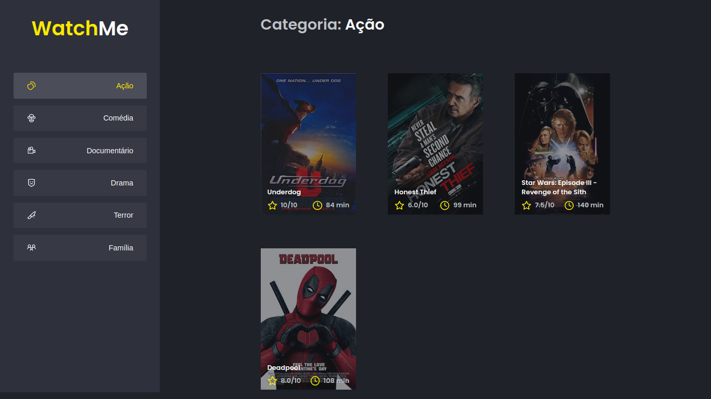

<div align="center">
  
</div>

<h1 align="center"> RocketSeat 🔥 Ignite ReactJS </h1>

<h2 align="center"> Desafio 02 : Componentizando a aplicação ( Projeto WatchMe ) </h2>

<p align="center">
  
  
  
</p>

## 🚀 Sobre o Projeto
O projeto consiste em uma aplicação de listagem de filmes, que são consumidos de uma fake api, o desafio pede para 
efetuar um componentização da aplicação pois a mesma se encontra toda no arquivo App.tsx, o objetivo é dividir a aplicação em dois componentes principais a SideBar e a Content, reutilizando todo o código da App.tsx, onde após a componentização ela deve ter o mesmo comportamento de quando não estava dividida em componentes.   

## 🖼️ Imagens do Projeto

<div align="center">
    
   </br>
</div>

## 🧰 Tecnologias Utilizadas
* VSCode ( IDE )
* ReactJS
* Axios
* HTML
* TypeScript
* SASS
* JavaScript
* JSON Server

## ⚙️ Rodando o Projeto
```bash
# Crie uma pasta 
$ mkdir react-ignite-components

# Clone este repositório para a pasta anterior
$ git clone https://github.com/brunoemferreira/rocketseat-ignite-react-desafio-componentizando-a-aplicacao.git
# ou use a opção de download.

# Instale as dependências
$ yarn install
ou
$ npm install

# Sobe o JSON Server que prove a api Fake para consumo dos dados dos arquivos json
# Abra um terminal que esteja na pasta do projeto e de o seguinte comando
$ yarn server

# Executando o Projeto
$ yarn dev 
ou
$ npm dev

# Acesse http://localhost:8080 no seu navagador
```
## 🌐 Referências

[Desafio 02 - WatchMe](https://www.notion.so/Desafio-02-Componentizando-a-aplica-o-b9f0f025c95b437699d0c3115f55b0f1) - Notion com todas as informações.

---

Feito com ❤️ por [Bruno Eduardo](https://gist.github.com/brunoemferreira) 😊


